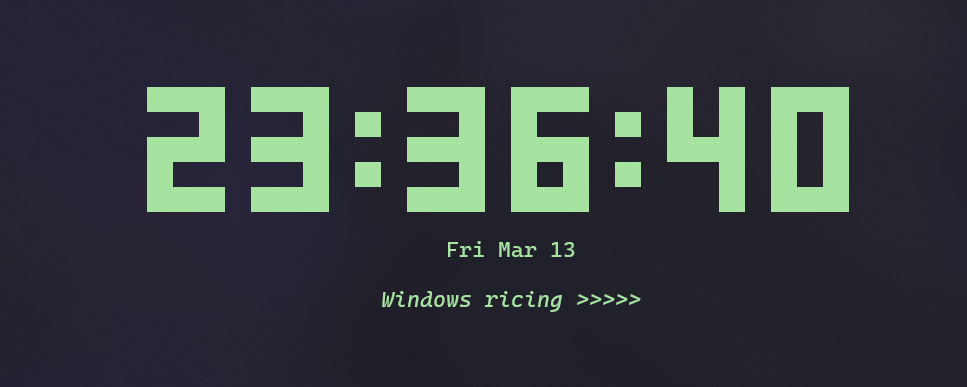

# Winclock

A digital clock for the windows terminal, inspired by the classic [tty-clock](https://github.com/xorg62/tty-clock).

## Features

- **Large ASCII Digits**: Easy to read from across the room.
- **Custom Quote**: Add your own quote to display on the clock.
- **Customizable Colors**: Set any hex color in the config or via CLI.
- **12/24 Hour Format**: Toggle between formats on the fly.
- **Blinking Colon**: Optional blinking animation for the time separator.
- **Interactive Controls**: Change settings while the clock is running.
- **Border Support**: Optional box around the clock for a classic terminal look.
- **Configuration File**: Save your preferences in `~/.winclock.properties`.

## Screenshots



## Installation

### Prerequisites

- Java 17 or higher
- Maven (for building from source)

### Building from Source

1. Clone the repository:

   ```bash
   git clone https://github.com/ashifu/win-clock.git
   cd win-clock
   ```

2. Build the project using Maven:

   ```bash
   mvn clean package
   ```

3. Run the clock:
   ```bash
   java -jar target/win-clock-1.0.jar
   ```

## Quick Install (Windows)

To add `winclock` to your terminal's command list, run the following in PowerShell from the project root:

```powershell
.\install.ps1
```

This will:

1. Build the project.
2. Create a local binary folder at `~/.winclock/bin`.
3. Add it to your User **PATH**.
4. Allow you to run the clock simply by typing `winclock`.

## Usage

### CLI Arguments

| Argument  | Long Form      | Description                           |
| --------- | -------------- | ------------------------------------- |
| `-s`      | `--seconds`    | Show seconds (default: true)          |
| `-ns`     | `--no-seconds` | Hide seconds                          |
| `-b`      | `--blink`      | Enable blinking colon (default: true) |
| `-nb`     | `--no-blink`   | Disable blinking colon                |
| `-12`     | `--12h`        | Use 12-hour format                    |
| `-24`     | `--24h`        | Use 24-hour format (default)          |
| `-box`    | `--box`        | Draw a border around the clock        |
| `-c #HEX` | `--color #HEX` | Set clock color (e.g., `-c #a6e3a1`)  |

### Interactive Keys

- `q`: Quit Winclock
- `s`: Toggle seconds display
- `b`: Toggle colon blinking
- `t`: Toggle 12/24 hour format

### Configuration

Create a file named `.winclock.properties` in your home directory (`C:\Users\<YourName>` on Windows or `/home/<YourName>` on Linux):

```properties
color.hex=#E5C3C3
date.format=EEE MMM d
quote.show=false
quote.text="Keep it simple."
show.seconds=true
blink.colon=true
use.12h=false
show.border=false
```

## License

This project is licensed under the MIT License - see the [LICENSE](LICENSE) file for details.
